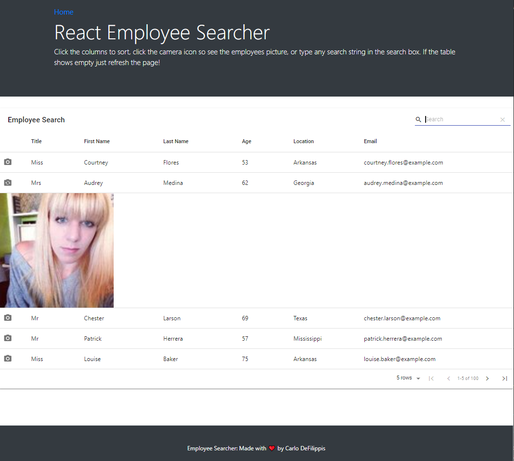

# React Employee Searcher

## Table of Contents
    
* [Description](#description)
* [Screenshot](#screenshot)
* [Installation](#installation)
* [Usage](#usage)
* [Github](#github)

## <a name="description">Description:</a>
*    A dynamic table built with React.js that can be sorted any way your heart desires!

## <a name="screenshot">Screenshot:</a>
*    

## <a name="installation">Installation:</a>
*    Go to the website provided [Here](https://carlo-defilippis.github.io/React_Employee_App/), no installation requirerd

## <a name="usage">Usage:</a>
*    To make dynamic lists

## <a name="github">Github URL:</a>
*    [https://github.com/Carlo-Defilippis/React_Employee_App](https://github.com/Carlo-Defilippis/React_Employee_App)
    